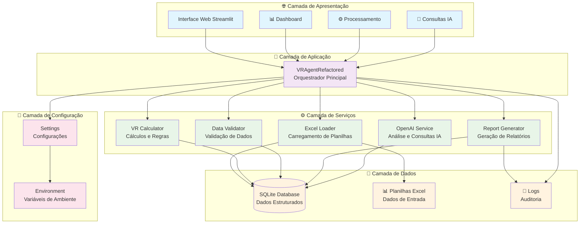
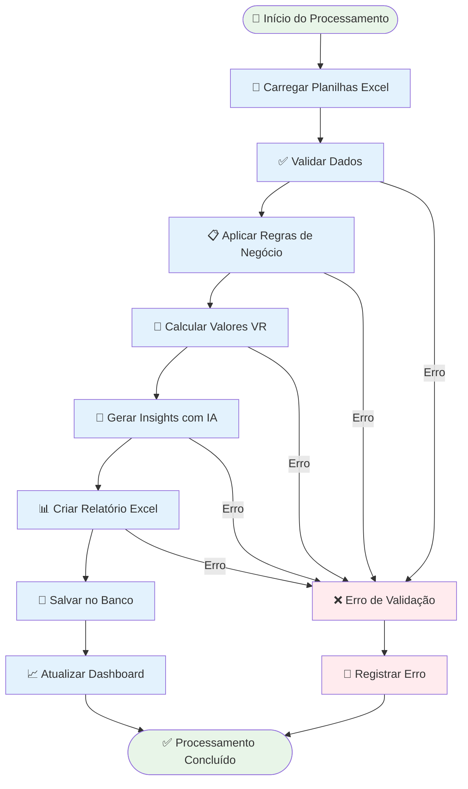
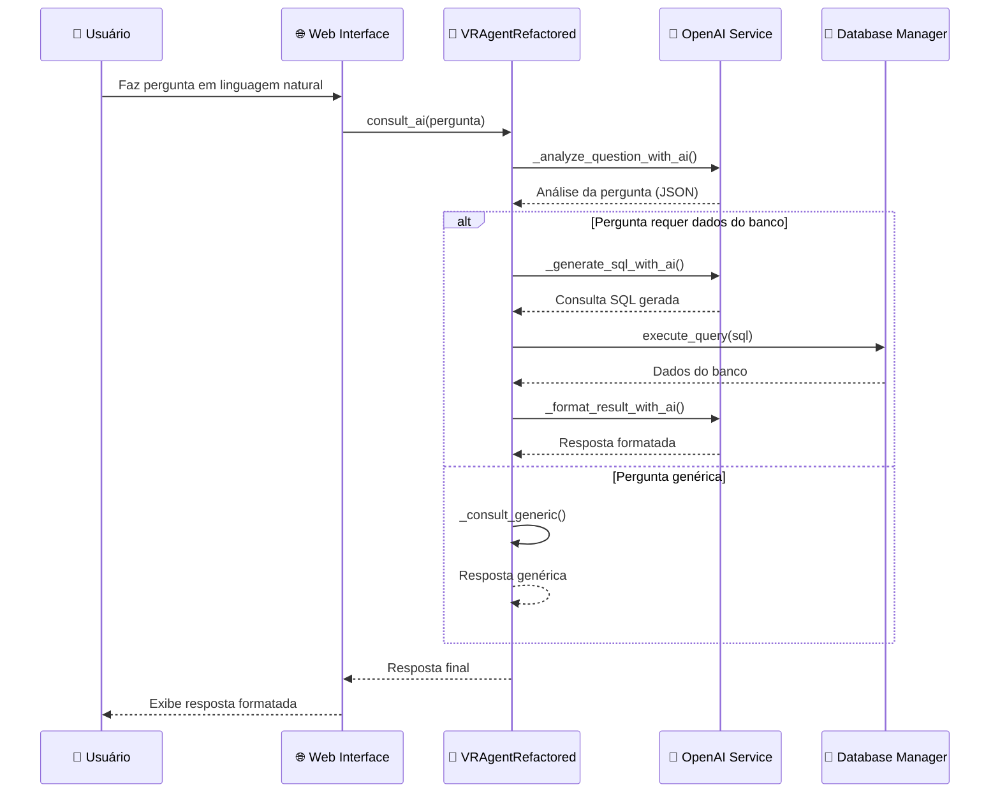
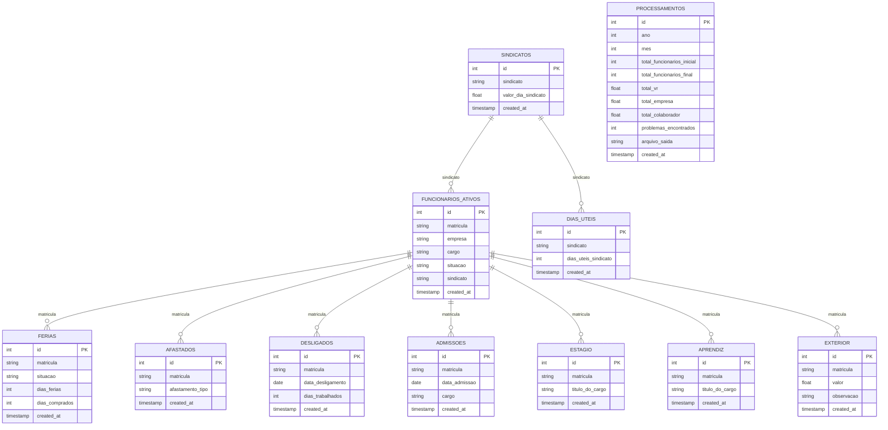
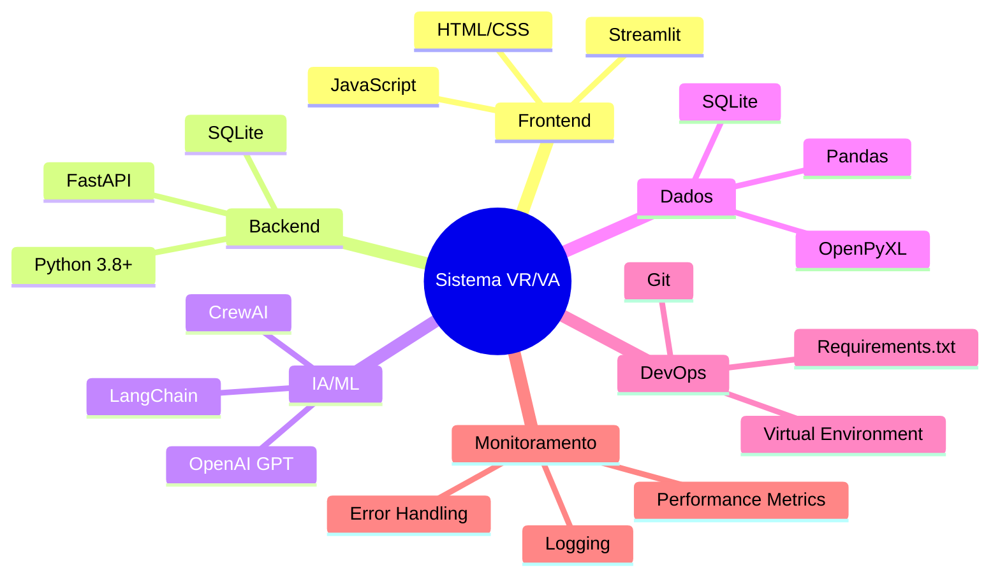

# 🏗️ Diagrama de Arquitetura - Sistema VR/VA

## Arquitetura Geral do Sistema

```mermaid
graph TB
    subgraph "🌐 Camada de Apresentação"
        UI[Interface Web Streamlit]
        DASH[📊 Dashboard]
        PROC[⚙️ Processamento]
        AI_TAB[🤖 Consultas IA]
    end
    
    subgraph "🧠 Camada de Aplicação"
        AGENT[VRAgentRefactored<br/>Orquestrador Principal]
    end
    
    subgraph "⚙️ Camada de Serviços"
        AI[OpenAI Service<br/>Análise e Consultas IA]
        CALC[VR Calculator<br/>Cálculos e Regras]
        VAL[Data Validator<br/>Validação de Dados]
        LOAD[Excel Loader<br/>Carregamento de Planilhas]
        GEN[Report Generator<br/>Geração de Relatórios]
    end
    
    subgraph "💾 Camada de Dados"
        DB[(SQLite Database<br/>Dados Estruturados)]
        EXCEL[📊 Planilhas Excel<br/>Dados de Entrada]
        LOGS[📝 Logs<br/>Auditoria]
    end
    
    subgraph "🔧 Camada de Configuração"
        CONFIG[Settings<br/>Configurações]
        ENV[Environment<br/>Variáveis de Ambiente]
    end
    
    %% Conexões da Interface
    UI --> AGENT
    DASH --> AGENT
    PROC --> AGENT
    AI_TAB --> AGENT
    
    %% Conexões do Agente Principal
    AGENT --> AI
    AGENT --> CALC
    AGENT --> VAL
    AGENT --> LOAD
    AGENT --> GEN
    
    %% Conexões dos Serviços com Dados
    LOAD --> EXCEL
    LOAD --> DB
    CALC --> DB
    VAL --> DB
    GEN --> DB
    AI --> DB
    
    %% Conexões de Configuração
    AGENT --> CONFIG
    CONFIG --> ENV
    
    %% Conexões de Logs
    GEN --> LOGS
    AGENT --> LOGS
    
    %% Estilos
    classDef interface fill:#e1f5fe
    classDef agent fill:#f3e5f5
    classDef service fill:#e8f5e8
    classDef data fill:#fff3e0
    classDef config fill:#fce4ec
    
    class UI,DASH,PROC,AI_TAB interface
    class AGENT agent
    class AI,CALC,VAL,LOAD,GEN service
    class DB,EXCEL,LOGS data
    class CONFIG,ENV config
```

## Fluxo de Processamento

```mermaid
flowchart TD
    START([🚀 Início do Processamento]) --> LOAD_DATA[📁 Carregar Planilhas Excel]
    LOAD_DATA --> VALIDATE[✅ Validar Dados]
    VALIDATE --> APPLY_RULES[📋 Aplicar Regras de Negócio]
    APPLY_RULES --> CALCULATE[🧮 Calcular Valores VR]
    CALCULATE --> GENERATE_AI[🤖 Gerar Insights com IA]
    GENERATE_AI --> CREATE_REPORT[📊 Criar Relatório Excel]
    CREATE_REPORT --> SAVE_DB[💾 Salvar no Banco]
    SAVE_DB --> DASHBOARD[📈 Atualizar Dashboard]
    DASHBOARD --> END([✅ Processamento Concluído])
    
    %% Tratamento de Erros
    VALIDATE -->|Erro| ERROR[❌ Erro de Validação]
    APPLY_RULES -->|Erro| ERROR
    CALCULATE -->|Erro| ERROR
    GENERATE_AI -->|Erro| ERROR
    CREATE_REPORT -->|Erro| ERROR
    ERROR --> LOG_ERROR[📝 Registrar Erro]
    LOG_ERROR --> END
    
    %% Estilos
    classDef process fill:#e3f2fd
    classDef error fill:#ffebee
    classDef success fill:#e8f5e8
    
    class LOAD_DATA,VALIDATE,APPLY_RULES,CALCULATE,GENERATE_AI,CREATE_REPORT,SAVE_DB,DASHBOARD process
    class ERROR,LOG_ERROR error
    class START,END success
```

## Fluxo de Consulta IA

```mermaid
sequenceDiagram
    participant U as 👤 Usuário
    participant W as 🌐 Web Interface
    participant A as 🧠 VRAgentRefactored
    participant AI as 🤖 OpenAI Service
    participant DB as 💾 Database Manager
    
    U->>W: Faz pergunta em linguagem natural
    W->>A: consult_ai(pergunta)
    A->>AI: _analyze_question_with_ai()
    AI-->>A: Análise da pergunta (JSON)
    
    alt Pergunta requer dados do banco
        A->>AI: _generate_sql_with_ai()
        AI-->>A: Consulta SQL gerada
        A->>DB: execute_query(sql)
        DB-->>A: Dados do banco
        A->>AI: _format_result_with_ai()
        AI-->>A: Resposta formatada
    else Pergunta genérica
        A->>A: _consult_generic()
        A-->>A: Resposta genérica
    end
    
    A-->>W: Resposta final
    W-->>U: Exibe resposta formatada
```

## Estrutura de Dados

```mermaid
erDiagram
    FUNCIONARIOS_ATIVOS {
        int id PK
        string matricula
        string empresa
        string cargo
        string situacao
        string sindicato
        timestamp created_at
    }
    
    SINDICATOS {
        int id PK
        string sindicato
        float valor_dia_sindicato
        timestamp created_at
    }
    
    DIAS_UTEIS {
        int id PK
        string sindicato
        int dias_uteis_sindicato
        timestamp created_at
    }
    
    FERIAS {
        int id PK
        string matricula
        string situacao
        int dias_ferias
        int dias_comprados
        timestamp created_at
    }
    
    AFASTADOS {
        int id PK
        string matricula
        string afastamento_tipo
        timestamp created_at
    }
    
    DESLIGADOS {
        int id PK
        string matricula
        date data_desligamento
        int dias_trabalhados
        timestamp created_at
    }
    
    ADMISSOES {
        int id PK
        string matricula
        date data_admissao
        string cargo
        timestamp created_at
    }
    
    ESTAGIO {
        int id PK
        string matricula
        string titulo_do_cargo
        timestamp created_at
    }
    
    APRENDIZ {
        int id PK
        string matricula
        string titulo_do_cargo
        timestamp created_at
    }
    
    EXTERIOR {
        int id PK
        string matricula
        float valor
        string observacao
        timestamp created_at
    }
    
    PROCESSAMENTOS {
        int id PK
        int ano
        int mes
        int total_funcionarios_inicial
        int total_funcionarios_final
        float total_vr
        float total_empresa
        float total_colaborador
        int problemas_encontrados
        string arquivo_saida
        timestamp created_at
    }
    
    FUNCIONARIOS_ATIVOS ||--o{ FERIAS : "matricula"
    FUNCIONARIOS_ATIVOS ||--o{ AFASTADOS : "matricula"
    FUNCIONARIOS_ATIVOS ||--o{ DESLIGADOS : "matricula"
    FUNCIONARIOS_ATIVOS ||--o{ ADMISSOES : "matricula"
    FUNCIONARIOS_ATIVOS ||--o{ ESTAGIO : "matricula"
    FUNCIONARIOS_ATIVOS ||--o{ APRENDIZ : "matricula"
    FUNCIONARIOS_ATIVOS ||--o{ EXTERIOR : "matricula"
    SINDICATOS ||--o{ FUNCIONARIOS_ATIVOS : "sindicato"
    SINDICATOS ||--o{ DIAS_UTEIS : "sindicato"
```

## Tecnologias Utilizadas

```mermaid
mindmap
  root((Sistema VR/VA))
    Frontend
      Streamlit
      HTML/CSS
      JavaScript
    Backend
      Python 3.8+
      FastAPI
      SQLite
    IA/ML
      OpenAI GPT
      LangChain
      CrewAI
    Dados
      Pandas
      OpenPyXL
      SQLite
    DevOps
      Git
      Virtual Environment
      Requirements.txt
    Monitoramento
      Logging
      Error Handling
      Performance Metrics
```

