# 📊 Fluxogramas - Sistema Auditor Fiscal

Este documento contém fluxogramas detalhados dos principais processos do Sistema Auditor Fiscal, organizados por funcionalidade e fluxo de dados.

---

## 📁 Índice de Fluxogramas

1. [Fluxo Geral do Sistema](#1-fluxo-geral-do-sistema)
2. [Fluxo de Inicialização](#2-fluxo-de-inicialização)
3. [Dashboard - Métricas Fiscais](#3-dashboard---métricas-fiscais)
4. [Listagem de Notas Fiscais](#4-listagem-de-notas-fiscais)
5. [Upload e Processamento de Documentos](#5-upload-e-processamento-de-documentos)
6. [Processamento de XML NFe](#6-processamento-de-xml-nfe)
7. [Análise com IA - Consulta Inteligente](#7-análise-com-ia---consulta-inteligente)
8. [Auditoria Automática de Notas Fiscais](#8-auditoria-automática-de-notas-fiscais)
9. [Validação Automática (FiscalAnalyzer v2)](#9-validação-automática-fiscalanalyzer-v2)
10. [Geração de Métricas Fiscais](#10-geração-de-métricas-fiscais)
11. [Fluxo de Tratamento de Erros](#11-fluxo-de-tratamento-de-erros)
12. [Geração de Relatórios](#12-geração-de-relatórios)

---

## 1. Fluxo Geral do Sistema

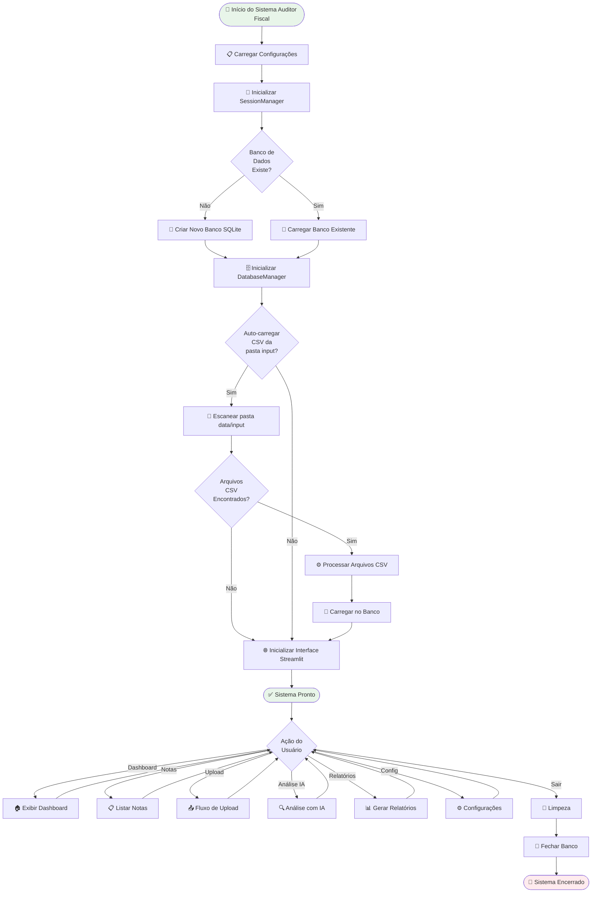

---

## 2. Fluxo de Inicialização

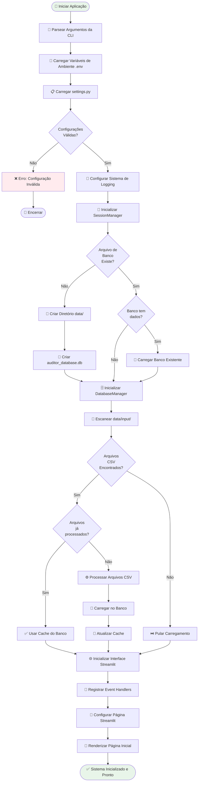

---

## 3. Dashboard - Métricas Fiscais

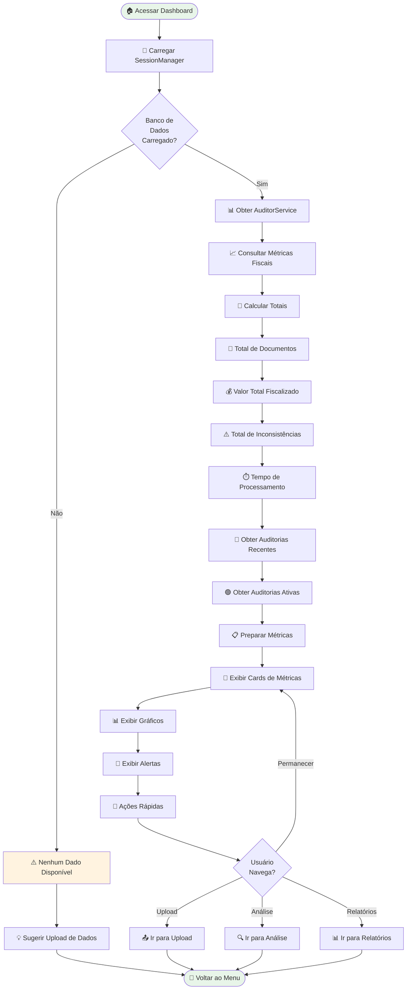

---

## 4. Listagem de Notas Fiscais

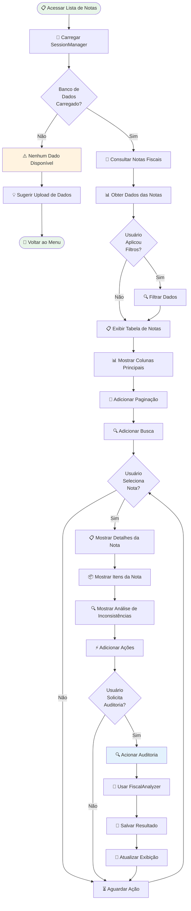

---

## 5. Upload e Processamento de Documentos

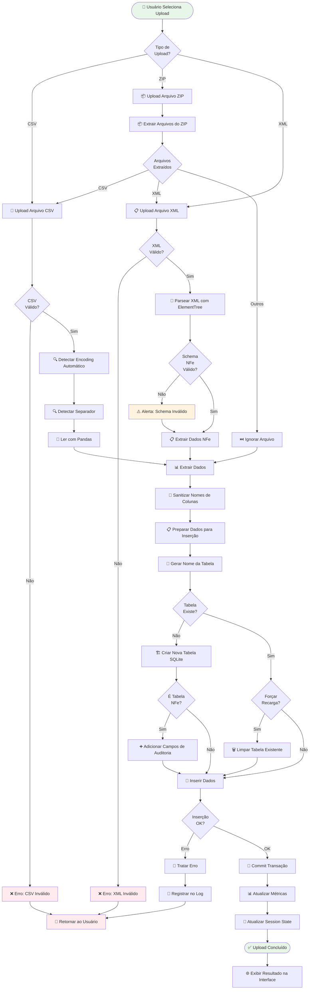

---

## 6. Processamento de XML NFe

```mermaid
flowchart TD
    START([📋 Iniciar Processamento XML NFe]) --> VALIDATE_FILE{Arquivo<br/>XML<br/>Válido?}
    
    VALIDATE_FILE -->|Não| ERROR_FILE[❌ Erro: Arquivo Inválido]
    ERROR_FILE --> END([🛑 Encerrar])
    
    VALIDATE_FILE -->|Sim| PARSE_XML[🔨 Parsear XML com ElementTree]
    
    PARSE_XML --> FIND_ROOT{Encontrar<br/>NFe<br/>Root?}
    
    FIND_ROOT -->|Não| ERROR_STRUCTURE[❌ Erro: Estrutura XML Inválida]
    ERROR_STRUCTURE --> END
    
    FIND_ROOT -->|Sim| EXTRACT_INFNFE[📋 Extrair infNFe]
    
    EXTRACT_INFNFE --> EXTRACT_IDE[📝 Extrair Dados de Identificação IDE]
    EXTRACT_IDE --> EXTRACT_EMIT[🏢 Extrair Dados do Emitente]
    EXTRACT_EMIT --> EXTRACT_DEST[👤 Extrair Dados do Destinatário]
    
    EXTRACT_DEST --> EXTRACT_TOTALS[💰 Extrair Totais]
    EXTRACT_TOTALS --> EXTRACT_ITEMS[📦 Extrair Itens]
    
    EXTRACT_ITEMS --> FOR_EACH_ITEM{Para cada<br/>Item}
    
    FOR_EACH_ITEM --> EXTRACT_PROD[📋 Extrair Produto]
    EXTRACT_PROD --> EXTRACT_IMPOSTO[📊 Extrair Impostos]
    EXTRACT_IMPOSTO --> EXTRACT_ICMS[🧾 Extrair ICMS]
    EXTRACT_ICMS --> EXTRACT_IPI[📝 Extrair IPI]
    EXTRACT_IPI --> EXTRACT_PIS[📄 Extrair PIS]
    EXTRACT_PIS --> EXTRACT_COFINS[📑 Extrair COFINS]
    
    EXTRACT_COFINS --> NEXT_ITEM{Próximo<br/>Item?}
    NEXT_ITEM -->|Sim| FOR_EACH_ITEM
    NEXT_ITEM -->|Não| PREPARE_NOTES_TABLE[📊 Preparar Dados Nota Fiscal]
    
    PREPARE_NOTES_TABLE --> PREPARE_ITEMS_TABLE[📦 Preparar Dados Itens]
    
    PREPARE_ITEMS_TABLE --> VALIDATE_DATA{Validar<br/>Dados<br/>Extraídos?}
    
    VALIDATE_DATA -->|Não| HANDLE_MISSING[⚠️ Tratar Dados Faltantes]
    HANDLE_MISSING --> CONTINUE_PROCESS
    
    VALIDATE_DATA -->|Sim| CONTINUE_PROCESS[▶️ Continuar Processamento]
    
    CONTINUE_PROCESS --> MAP_TO_DB[🗺️ Mapear para Estrutura do Banco]
    MAP_TO_DB --> INSERT_NOTES[💾 Inserir na Tabela nfe_notas_fiscais]
    
    INSERT_NOTES --> GET_NOTES_ID[🔑 Obter ID da Nota]
    GET_NOTES_ID --> INSERT_ITEMS[💾 Inserir Itens na Tabela nfe_itens_nota]
    
    INSERT_ITEMS --> COMMIT[💾 Commit Transação]
    COMMIT --> UPDATE_METRICS[📊 Atualizar Métricas]
    UPDATE_METRICS --> SUCCESS([✅ XML Processado com Sucesso])
    
    style START fill:#e8f5e9
    style SUCCESS fill:#e8f5e9
    style ERROR_FILE fill:#ffebee
    style ERROR_STRUCTURE fill:#ffebee
    style HANDLE_MISSING fill:#fff3e0
```

---

## 7. Análise com IA - Consulta Inteligente

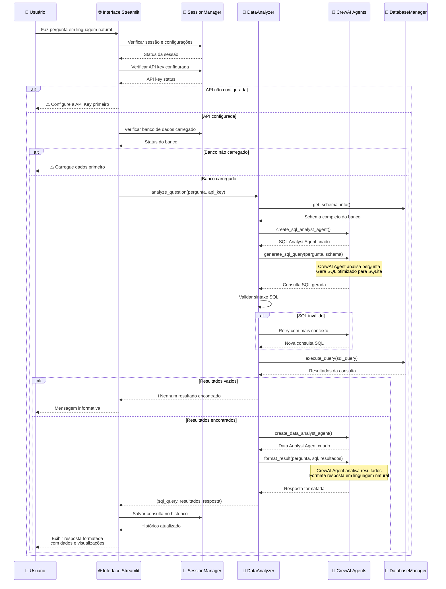

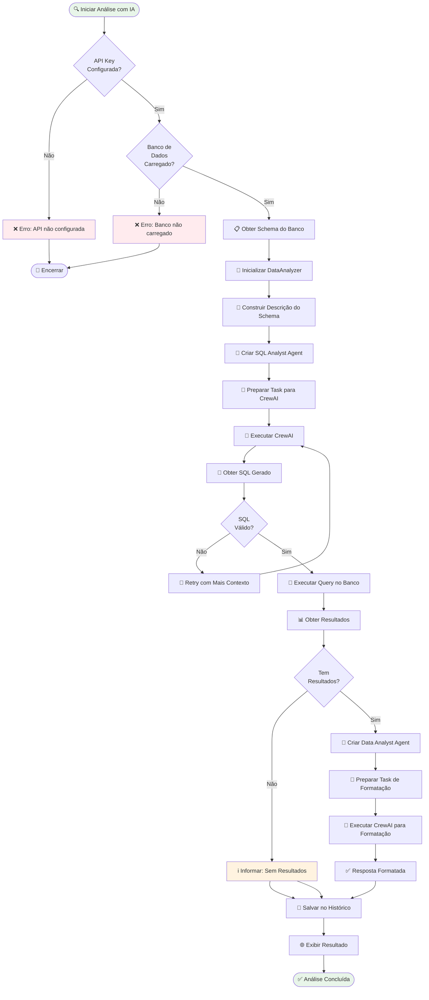

---

## 8. Auditoria Automática de Notas Fiscais

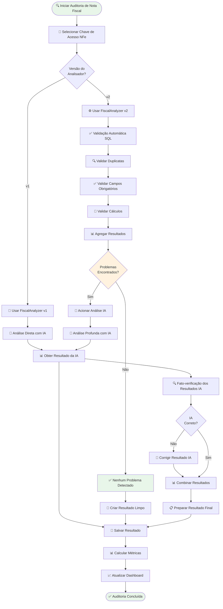

---

## 9. Validação Automática (FiscalAnalyzer v2)

```mermaid
flowchart TD
    START([✅ Iniciar Validação Automática]) --> INIT_AUTO_VALIDATOR[⚙️ Inicializar AutoValidator]
    
    INIT_AUTO_VALIDATOR --> VALIDATE_DUPLICATES[🔍 Validar Duplicatas]
    
    VALIDATE_DUPLICATES --> CHECK_DUP_SQL[📝 Query SQL: COUNT chave_acesso]
    CHECK_DUP_SQL --> DUP_RESULT[📊 Resultado da Query]
    DUP_RESULT --> HAS_DUP{Duplicatas<br/>Encontradas?}
    
    HAS_DUP -->|Sim| MARK_DUP[⚠️ Marcar como Duplicata]
    HAS_DUP -->|Não| VALIDATE_REQUIRED
    
    MARK_DUP --> VALIDATE_REQUIRED[✅ Validar Campos Obrigatórios]
    
    VALIDATE_REQUIRED --> CHECK_REQUIRED_SQL[📝 Query SQL: SELECT campos obrigatórios]
    CHECK_REQUIRED_SQL --> REQUIRED_RESULT[📊 Resultado da Query]
    REQUIRED_RESULT --> CHECK_NULL{Campos<br/>NULL ou<br/>vazios?}
    
    CHECK_NULL -->|Sim| MARK_MISSING[⚠️ Marcar Campos Faltantes]
    CHECK_NULL -->|Não| VALIDATE_CALCULATIONS
    
    MARK_MISSING --> VALIDATE_CALCULATIONS[🧮 Validar Cálculos Fiscais]
    
    VALIDATE_CALCULATIONS --> CHECK_TOTALS_SQL[📝 Query SQL: Comparar totais]
    CHECK_TOTALS_SQL --> TOTALS_RESULT[📊 Resultado da Comparação]
    TOTALS_RESULT --> CHECK_MATCH{Totais<br/>Batem?}
    
    CHECK_MATCH -->|Não| MARK_CALC_ERROR[⚠️ Marcar Erro de Cálculo]
    CHECK_MATCH -->|Sim| AGGREGATE_RESULTS
    
    MARK_CALC_ERROR --> AGGREGATE_RESULTS[📊 Agregar Todos os Resultados]
    
    AGGREGATE_RESULTS --> COUNT_ISSUES[🔢 Contar Problemas]
    COUNT_ISSUES --> HAS_ISSUES{Tem<br/>Problemas?}
    
    HAS_ISSUES -->|Não| RETURN_CLEAN[✅ Retornar: Validação OK]
    HAS_ISSUES -->|Sim| RETURN_ISSUES[⚠️ Retornar: Lista de Problemas]
    
    RETURN_CLEAN --> END([✅ Validação Concluída])
    RETURN_ISSUES --> END
    
    style START fill:#e8f5e9
    style RETURN_CLEAN fill:#e8f5e9
    style END fill:#e8f5e9
    style MARK_DUP fill:#fff3e0
    style MARK_MISSING fill:#fff3e0
    style MARK_CALC_ERROR fill:#fff3e0
    style RETURN_ISSUES fill:#fff3e0
```

---

## 10. Geração de Métricas Fiscais

```mermaid
flowchart TD
    START([📊 Gerar Métricas Fiscais]) --> GET_AUDIT_SERVICE[📝 Obter AuditorService]
    
    GET_AUDIT_SERVICE --> GET_ALL_RESULTS[💾 Obter Todos os Resultados de Auditoria]
    
    GET_ALL_RESULTS --> QUERY_DB[📝 Query: SELECT * FROM auditor_results]
    QUERY_DB --> RESULTS[📊 Resultados do Banco]
    
    RESULTS --> AGGREGATE_TOTALS[🧮 Agregar Totais]
    
    AGGREGATE_TOTALS --> CALC_DOC_COUNT[🔢 Calcular: Total de Documentos]
    CALC_DOC_COUNT --> CALC_TOTAL_VALUE[💰 Calcular: Valor Total Fiscalizado]
    CALC_TOTAL_VALUE --> CALC_INCONSISTENCIES[⚠️ Calcular: Total de Inconsistências]
    
    CALC_INCONSISTENCIES --> CALC_AVG_TIME[⏱️ Calcular: Tempo Médio de Processamento]
    CALC_AVG_TIME --> CALC_SUCCESS_RATE[📈 Calcular: Taxa de Sucesso]
    
    CALC_SUCCESS_RATE --> GROUP_BY_STATUS[📊 Agrupar por Status]
    GROUP_BY_STATUS --> COUNT_BY_STATUS[🔢 Contar por Status]
    
    COUNT_BY_STATUS --> GROUP_BY_TYPE[📊 Agrupar por Tipo de Análise]
    GROUP_BY_TYPE --> COUNT_BY_TYPE[🔢 Contar por Tipo]
    
    COUNT_BY_TYPE --> GET_RECENT[📅 Obter Auditorias Recentes]
    GET_RECENT --> GET_ACTIVE[🟢 Obter Auditorias Ativas]
    
    GET_ACTIVE --> PREPARE_METRICS[📋 Preparar Dicionário de Métricas]
    
    PREPARE_METRICS --> RETURN_METRICS[📊 Retornar Métricas]
    RETURN_METRICS --> DISPLAY_DASHBOARD[🌐 Exibir no Dashboard]
    
    DISPLAY_DASHBOARD --> SUCCESS([✅ Métricas Geradas])
    
    style START fill:#e8f5e9
    style SUCCESS fill:#e8f5e9
```

---

## 11. Fluxo de Tratamento de Erros

```mermaid
flowchart TD
    ERROR([❌ Erro Detectado]) --> CLASSIFY{Classificar<br/>Tipo de<br/>Erro}
    
    CLASSIFY -->|Validação| VALIDATION_ERROR[🔴 Erro de Validação]
    CLASSIFY -->|Processamento| PROCESS_ERROR[🟠 Erro de Processamento]
    CLASSIFY -->|IA/API| API_ERROR[🟡 Erro de API/IA]
    CLASSIFY -->|Banco| DB_ERROR[🔵 Erro de Banco de Dados]
    CLASSIFY -->|Sistema| SYSTEM_ERROR[⚫ Erro de Sistema]
    
    VALIDATION_ERROR --> LOG_VALIDATION[📝 Log: Erro de Validação]
    LOG_VALIDATION --> NOTIFY_USER_VAL[👤 Notificar: Dados Inválidos]
    NOTIFY_USER_VAL --> RECOVERABLE_VAL{Pode<br/>Recuperar?}
    
    RECOVERABLE_VAL -->|Sim| TRY_CORRECT[🔧 Tentar Corrigir Dados]
    TRY_CORRECT --> VALIDATE_AGAIN{Correção<br/>OK?}
    VALIDATE_AGAIN -->|Sim| CONTINUE_PROC[▶️ Continuar Processamento]
    VALIDATE_AGAIN -->|Não| ROLLBACK_VAL[↩️ Rollback]
    
    RECOVERABLE_VAL -->|Não| ROLLBACK_VAL
    
    PROCESS_ERROR --> LOG_PROCESS[📝 Log: Erro de Processamento]
    LOG_PROCESS --> NOTIFY_USER_PROC[👤 Notificar: Erro no Processamento]
    NOTIFY_USER_PROC --> RETRY_PROC{Retry<br/>Disponível?}
    
    RETRY_PROC -->|Sim| RETRY[🔄 Tentar Novamente]
    RETRY --> MAX_RETRIES{Excedeu<br/>Limite?}
    MAX_RETRIES -->|Não| CONTINUE_PROC
    MAX_RETRIES -->|Sim| ABORT[🛑 Abortar Operação]
    
    RETRY_PROC -->|Não| ABORT
    
    API_ERROR --> LOG_API[📝 Log: Erro de API]
    LOG_API --> CHECK_API_STATUS{API<br/>Disponível?}
    
    CHECK_API_STATUS -->|Sim| RETRY_API[🔄 Retry Chamada API]
    CHECK_API_STATUS -->|Não| FALLBACK[🔄 Usar Modo Sem IA]
    
    RETRY_API --> CONTINUE_PROC
    FALLBACK --> NOTIFY_FALLBACK[👤 Notificar: Modo Limitado]
    NOTIFY_FALLBACK --> CONTINUE_PROC
    
    DB_ERROR --> LOG_DB[📝 Log: Erro de Banco]
    LOG_DB --> CHECK_DB_CONN{Conexão<br/>OK?}
    
    CHECK_DB_CONN -->|Sim| RETRY_DB[🔄 Retry Operação DB]
    CHECK_DB_CONN -->|Não| RECONNECT[🔌 Reconectar ao Banco]
    
    RETRY_DB --> CONTINUE_PROC
    RECONNECT --> RECONNECT_OK{Conexão<br/>Restabelecida?}
    RECONNECT_OK -->|Sim| CONTINUE_PROC
    RECONNECT_OK -->|Não| ABORT
    
    SYSTEM_ERROR --> LOG_SYSTEM[📝 Log: Erro de Sistema]
    LOG_SYSTEM --> NOTIFY_ADMIN[👨‍💼 Notificar Administrador]
    NOTIFY_ADMIN --> ABORT
    
    ROLLBACK_VAL --> CLEANUP[🧹 Limpeza]
    ABORT --> CLEANUP
    CONTINUE_PROC --> SUCCESS[✅ Processamento Continua]
    
    CLEANUP --> END([🛑 Processamento Encerrado])
    
    style ERROR fill:#ffebee
    style END fill:#ffebee
    style ABORT fill:#ff5252
    style VALIDATION_ERROR fill:#ef5350
    style PROCESS_ERROR fill:#ff9800
    style API_ERROR fill:#ffc107
    style DB_ERROR fill:#2196f3
    style SYSTEM_ERROR fill:#424242
    style SUCCESS fill:#4caf50
    style CONTINUE_PROC fill:#e8f5e9
```

---

## 12. Geração de Relatórios

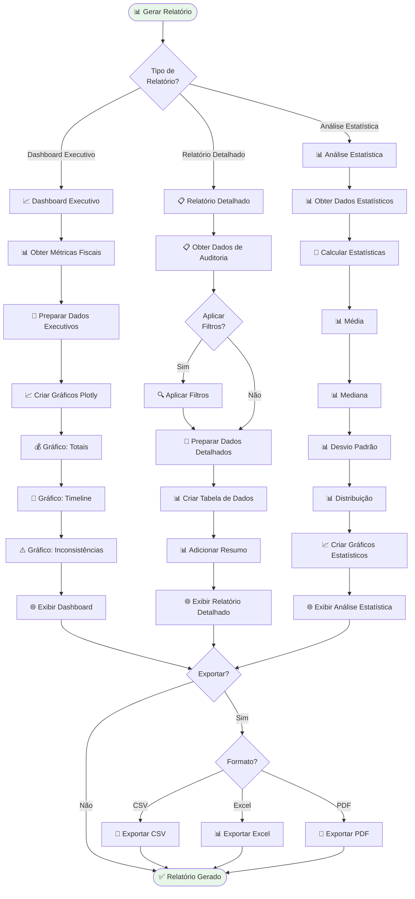

---

**Última atualização**: 2025-01-27
**Versão da Documentação**: 1.1
**Sistema**: Auditor Fiscal
