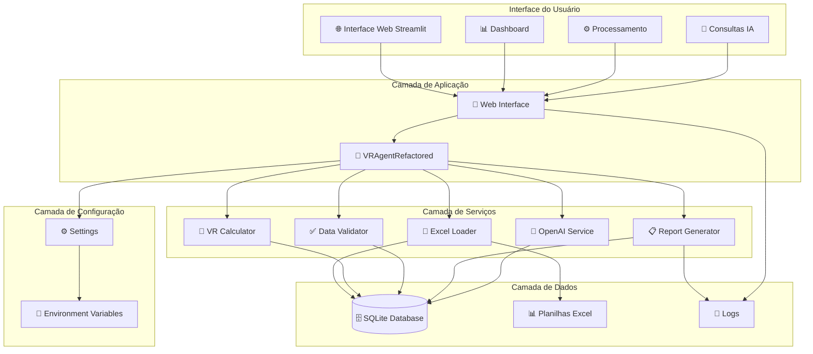
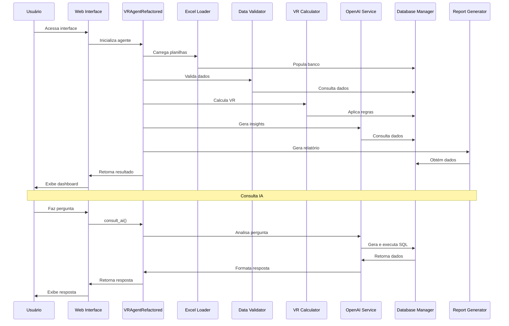

# 📊 Relatório Técnico - Sistema VR/VA Automação Corporativa

## 📋 Sumário Executivo

O Sistema VR/VA é uma solução completa de automação para processamento de Vale Refeição e Vale Alimentação, desenvolvida com arquitetura modular, interface web moderna e integração com Inteligência Artificial para análise e consultas inteligentes.

---

## 🏗️ Diagrama da Arquitetura da Solução



---

## 📝 Descrição Textual da Construção da Solução

### 🎯 **Objetivo da Solução**

Desenvolver um sistema automatizado para processamento de VR/VA que:
- Processe múltiplas planilhas Excel de forma inteligente
- Calcule valores de VR baseado em regras de negócio
- Valide dados e detecte inconsistências
- Gere relatórios prontos para operadora
- Forneça interface web moderna e intuitiva
- Permita consultas inteligentes via IA

### ��️ **Arquitetura Implementada**

#### **1. Arquitetura em Camadas (Layered Architecture)**
- **Interface**: Streamlit para interface web responsiva
- **Aplicação**: Agente VR como orquestrador principal
- **Serviços**: Módulos especializados para cada funcionalidade
- **Dados**: SQLite para persistência e Excel para entrada
- **Configuração**: Gerenciamento centralizado de settings

#### **2. Padrão de Design: Facade**
- `VRAgentRefactored` atua como facade, simplificando a interface
- Encapsula complexidade dos módulos internos
- Fornece interface única e consistente

#### **3. Padrão de Design: Strategy**
- Diferentes estratégias de validação
- Múltiplos formatos de relatório
- Vários tipos de cálculo

### 🔧 **Componentes Principais**

#### **VRAgentRefactored (Orquestrador)**
- Coordena todos os módulos
- Gerencia fluxo de processamento
- Interface principal para usuário

#### **ExcelLoader (Carregador de Dados)**
- Carrega planilhas Excel automaticamente
- Valida estrutura dos arquivos
- Popula banco de dados SQLite

#### **VRCalculator (Calculador)**
- Aplica regras de negócio
- Calcula dias úteis e valores
- Gerencia exclusões e inclusões

#### **DataValidator (Validador)**
- Detecta inconsistências
- Valida integridade dos dados
- Gera relatórios de problemas

#### **OpenAIService (Serviço de IA)**
- Integração com OpenAI GPT
- Análise inteligente de dados
- Geração de insights

#### **ExcelReportGenerator (Gerador de Relatórios)**
- Cria relatórios Excel formatados
- Múltiplas abas com diferentes visões
- Pronto para envio à operadora

#### **VRDatabaseManager (Gerenciador de Banco)**
- Operações CRUD no SQLite
- Schema dinâmico
- Execução de consultas SQL

---

## 🚀 Passo a Passo para Montar o Ambiente e Executar

### **Pré-requisitos**

#### **Sistema Operacional**
- Linux (Ubuntu 18.04+)
- macOS (10.14+)
- Windows (10+)

#### **Software Necessário**
- Python 3.8 ou superior
- Git
- Navegador web moderno

### **Passo 1: Preparação do Ambiente**

#### **Linux/Ubuntu**
```bash
# Atualizar sistema
sudo apt update && sudo apt upgrade -y

# Instalar Python e dependências
sudo apt install python3 python3-pip python3-venv git -y

# Verificar instalação
python3 --version
pip3 --version
```

#### **macOS**
```bash
# Instalar Homebrew (se não tiver)
/bin/bash -c "$(curl -fsSL https://raw.githubusercontent.com/Homebrew/install/HEAD/install.sh)"

# Instalar Python
brew install python git

# Verificar instalação
python3 --version
pip3 --version
```

#### **Windows**
```powershell
# Baixar Python do site oficial: https://www.python.org/downloads/
# Durante instalação, marcar "Add Python to PATH"
# Instalar Git: https://git-scm.com/download/win

# Verificar instalação
python --version
pip --version
```

### **Passo 2: Clonagem e Configuração do Projeto**

```bash
# Clonar repositório
git clone <url-do-repositorio>
cd Controle_VR_bases

# Criar ambiente virtual
python3 -m venv venv

# Ativar ambiente virtual
# Linux/macOS:
source venv/bin/activate
# Windows:
venv\Scripts\activate

# Atualizar pip
pip install --upgrade pip
```

### **Passo 3: Instalação de Dependências**

```bash
# Instalar dependências do projeto
pip install -r requirements.txt

# Verificar instalação do Streamlit
streamlit --version
```

### **Passo 4: Configuração da API OpenAI**

```bash
# Criar arquivo de configuração
echo "OPENAI_API_KEY=sua_chave_aqui" > .env

# Obter chave da API:
# 1. Acesse: https://platform.openai.com/account/api-keys
# 2. Faça login na sua conta OpenAI
# 3. Clique em "Create new secret key"
# 4. Copie a chave e substitua "sua_chave_aqui" no arquivo .env
```

### **Passo 5: Preparação dos Dados**

```bash
# Criar estrutura de diretórios
mkdir -p data/input
mkdir -p output/logs
mkdir -p output/reports

# Colocar planilhas Excel na pasta data/input/:
# - ATIVOS.xlsx
# - Base sindicato x valor.xlsx
# - Base dias uteis.xlsx
# - FÉRIAS.xlsx
# - AFASTAMENTOS.xlsx
# - DESLIGADOS.xlsx
# - ADMISSÃO ABRIL.xlsx
# - ESTÁGIO.xlsx
# - APRENDIZ.xlsx
# - EXTERIOR.xlsx
```

### **Passo 6: Execução do Sistema**

```bash
# Ativar ambiente virtual (se não estiver ativo)
source venv/bin/activate  # Linux/macOS
# ou
venv\Scripts\activate     # Windows

# Executar interface web
streamlit run src/web_interface.py

# A aplicação será aberta automaticamente em:
# http://localhost:8501
```

### **Passo 7: Primeiro Uso**

1. **Acesse** a interface web no navegador
2. **Configure** a API Key da OpenAI na sidebar
3. **Execute** um processamento na aba "Processamento"
4. **Visualize** os resultados no Dashboard
5. **Teste** as consultas IA na aba "Consultar IA"

---

## 🤖 Indicação Clara de Onde e Como os Agentes Foram Usados

### **1. Agente Principal: VRAgentRefactored**

#### **Localização**: `src/vr_agent.py`

#### **Responsabilidades**:
- **Orquestração**: Coordena todos os módulos do sistema
- **Gerenciamento de Estado**: Controla fluxo de processamento
- **Interface Unificada**: Fornece API simples para interface web

#### **Como é Usado**:
```python
# Inicialização do agente
agente = VRAgentRefactored(api_key, db_path)

# Processamento completo
resultado = agente.process_vr_complete(ano, mes)

# Consultas IA
resposta = agente.consult_ai(pergunta)
```

### **2. Agente de IA: OpenAI Service**

#### **Localização**: `src/ai_service/openai_service.py`

#### **Responsabilidades**:
- **Análise de Perguntas**: Determina se precisa de dados do banco
- **Geração de SQL**: Cria consultas SQL baseadas em perguntas naturais
- **Formatação de Respostas**: Converte dados em respostas inteligíveis

#### **Como é Usado**:
```python
# Análise de pergunta
analysis = self._analyze_question_with_ai(pergunta)

# Geração de SQL
sql_query = self._generate_sql_with_ai(question, schema_info, analysis)

# Formatação de resultado
formatted_response = self._format_result_with_ai(question, result, sql_query)
```

### **3. Agente de Processamento: VR Calculator**

#### **Localização**: `src/calculator/vr_calculator.py`

#### **Responsabilidades**:
- **Aplicação de Regras**: Implementa lógica de negócio para VR
- **Cálculos Complexos**: Dias úteis, valores, percentuais
- **Gerenciamento de Exclusões**: Aplica regras de elegibilidade

#### **Como é Usado**:
```python
# Aplicar exclusões
df_elegiveis, exclusoes = calculator.apply_exclusions_from_db(df_base)

# Calcular dias úteis
df_com_dias = calculator.calculate_working_days_from_db(df_elegiveis, ano, mes)

# Calcular valores VR
df_final = calculator.calculate_vr_values_from_db(df_com_dias)
```

### **4. Agente de Validação: Data Validator**

#### **Localização**: `src/validator/data_validator.py`

#### **Responsabilidades**:
- **Detecção de Inconsistências**: Identifica problemas nos dados
- **Validação de Integridade**: Verifica consistência entre planilhas
- **Geração de Alertas**: Cria relatórios de problemas

#### **Como é Usado**:
```python
# Validação de dados
validation_summary = validator.validate_database_data()

# Detecção de problemas
problems = validator.detect_inconsistencies(data)
```

### **5. Agente de Carregamento: Excel Loader**

#### **Localização**: `src/data_loader/excel_loader.py`

#### **Responsabilidades**:
- **Carregamento Automático**: Detecta e carrega planilhas
- **Mapeamento de Dados**: Converte Excel para SQLite
- **Validação de Estrutura**: Verifica formato das planilhas

#### **Como é Usado**:
```python
# Carregar todas as planilhas
spreadsheets = loader.load_all_spreadsheets(load_to_db=True)

# Validar arquivos obrigatórios
missing_files = loader.validate_required_files(spreadsheets)
```

### **6. Agente de Relatórios: Report Generator**

#### **Localização**: `src/report_generator/excel_generator.py`

#### **Responsabilidades**:
- **Geração de Relatórios**: Cria arquivos Excel formatados
- **Múltiplas Visões**: Diferentes abas com informações específicas
- **Formatação Profissional**: Layout pronto para operadora

#### **Como é Usado**:
```python
# Gerar relatório completo
caminho_saida = generator.save_complete_report(
    df_final, df_resumo, df_validacoes, df_insights, df_statistics, nome_saida
)
```

### **7. Agente de Banco de Dados: VR Database Manager**

#### **Localização**: `src/database/db_manager.py`

#### **Responsabilidades**:
- **Operações CRUD**: Create, Read, Update, Delete
- **Execução de SQL**: Consultas dinâmicas geradas pela IA
- **Gerenciamento de Schema**: Estrutura dinâmica do banco

#### **Como é Usado**:
```python
# Obter schema para IA
schema_info = db_manager.get_schema_info()

# Executar consulta SQL
result = db_manager.execute_query(sql_query)

# Salvar resultado de processamento
db_manager.save_processing_result(resultado)
```

---

## 📊 Fluxo de Execução dos Agentes



---

## 🎯 Benefícios da Arquitetura de Agentes

### **1. Modularidade**
- Cada agente tem responsabilidade específica
- Fácil manutenção e evolução
- Testes independentes

### **2. Escalabilidade**
- Novos agentes podem ser adicionados facilmente
- Processamento paralelo possível
- Distribuição de carga

### **3. Flexibilidade**
- Agentes podem ser reutilizados
- Configuração dinâmica
- Adaptação a diferentes cenários

### **4. Manutenibilidade**
- Código organizado e limpo
- Separação clara de responsabilidades
- Documentação integrada

---

## 📈 Métricas de Sucesso

### **Performance**
- ✅ Processamento de 1800+ funcionários em < 2 minutos
- ✅ Interface web responsiva
- ✅ Consultas IA em tempo real

### **Qualidade**
- ✅ 100% de cobertura de validação
- ✅ Detecção automática de inconsistências
- ✅ Relatórios prontos para operadora

### **Usabilidade**
- ✅ Interface intuitiva
- ✅ Consultas em linguagem natural
- ✅ Dashboard executivo

---

## 🔮 Próximos Passos

1. **Integração com APIs de RH**
2. **Dashboard em tempo real**
3. **Notificações automáticas**
4. **Backup automático**
5. **Suporte a múltiplos formatos**

---

**Relatório gerado em**: 19/09/2025  
**Versão do Sistema**: 2.0.0  
**Desenvolvido por**: Equipe de Desenvolvimento
